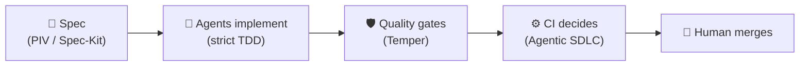

<h1 align="center">Hey, I'm Gal Naor 👋</h1>

  <strong>Engineering Manager @ Booking.com</strong> · Amsterdam 🇳🇱

  <em>I build backend systems, grow engineering teams, and design the workflows 
  that make AI agents write production-grade code.</em>

  
  

---

## 🧭 What I bring to the table

<table align="center">
  <tr>
    <th>🛠️ Engineer</th>
    <th>👥 Engineering Manager</th>
    <th>🤖 AI-Native Builder</th>
  </tr>
  <tr>
    <td>
      ~20 years building backend systems that stay up under load — JVM at heart
      (Java, Scala, Kotlin), fluent in TypeScript and Python, opinionated about
      clean architecture and system design.
    </td>
    <td>
      Leading and scaling engineering teams at Booking.com. I care about
      growing engineers, shipping predictably, and building teams where
      quality is a habit — not a heroic effort.
    </td>
    <td>
      I don't just <em>use</em> AI coding agents — I build the guardrails
      around them: specs, TDD loops, quality gates, and CI-driven agent
      workflows that close the gap between "AI-generated" and "production-grade."
    </td>
  </tr>
</table>

---

## 🚀 Featured projects

| Project | What it does | |
|---|---|---:|
| **[piv-speckit](https://github.com/galando/piv-speckit)** | PIV (Prime-Implement-Validate) + Spec-Kit: structured specs and strict TDD for AI-assisted development. Works with Claude Code, Cursor, and Copilot. | ⭐ 28 |
| **[temper](https://github.com/galando/temper)** | A Claude Code plugin that closes the quality gap in AI-generated code — try it in 5 minutes with the [playground](https://github.com/galando/temper-playground). | ⭐ 13 |
| **[tokenomics](https://github.com/galando/tokenomics)** | CLI that analyzes your complete Claude Code session history, finds behavioral patterns that waste tokens, and coaches you with personalized advice. | ⭐ 8 |
| **[agentic-sdlc](https://github.com/galando/agentic-sdlc)** | Provider-agnostic GitHub template for an autonomous-agent SDLC: **agents propose, CI decides, a human merges.** | 🧪 |
| **[tank](https://github.com/tankpkg/tank)** | Security-focused package manager for AI agent capabilities. | 🔐 |

🎲 Side quests

 

- **[dip-scanner](https://github.com/galando/dip-scanner)** — S&P 500 quality-dip scanner: a Telegram bot that finds strong companies on hard dips, with stabilization evidence.
- **[world-cup-2026-predictor](https://github.com/galando/world-cup-2026-predictor)** — because engineering rigor should also settle football arguments. ⚽

---

## ⚙️ How I ship with AI agents

> AI doesn't lower the quality bar — a missing workflow does.
> So I build the workflow.

---

## 🧰 Toolbox

**Languages**

**Backend & data**

**AI engineering**

---

## 📊 GitHub stats

  
  

---

  💬 Always happy to talk about engineering leadership, backend architecture, 
  or how to make AI agents ship code you'd actually merge.

  

