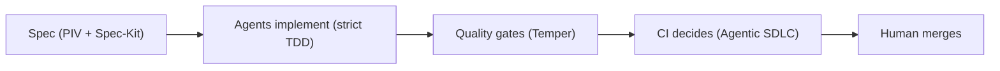

<h1 align="center">Hey, I am Gal Naor 👋</h1>

  <strong>Engineering Manager @ Booking.com</strong> · Amsterdam 🇳🇱

  <em>I build backend systems, lead engineering teams, 
  and make AI agents write code you would actually merge.</em>

  
  
  

---

## 🧭 What I do

<table align="center">
  <tr>
    <th width="33%">🛠️ Engineer</th>
    <th width="33%">👥 Engineering Manager</th>
    <th width="33%">🤖 AI Builder</th>
  </tr>
  <tr>
    <td>
      20 years of building backend systems that stay up under load.
      JVM at heart (Java, Scala, Kotlin), also TypeScript and Python.
      Big on clean architecture and system design.
    </td>
    <td>
      Leading and scaling engineering teams at Booking.com.
      I focus on growing engineers, shipping predictably, and making
      quality a habit.
    </td>
    <td>
      I build the guardrails around AI coding agents: specs, TDD loops,
      quality gates, and CI-driven workflows that turn AI-generated code
      into production-grade code.
    </td>
  </tr>
</table>

---

## ⚙️ How I ship with AI agents

> AI does not lower the quality bar; a missing workflow does.
> So I build the workflow.

---

## 🚀 Featured projects

| Project | What it does | Stars |
|---|---|:---:|
| **[piv-speckit](https://github.com/galando/piv-speckit)** | PIV (Prime-Implement-Validate) + Spec-Kit: structured specs and strict TDD for AI-assisted development. Works with Claude Code, Cursor, and Copilot. |  |
| **[temper](https://github.com/galando/temper)** | A Claude Code plugin that closes the quality gap in AI-generated code. Try it in 5 minutes with the [playground](https://github.com/galando/temper-playground). |  |
| **[tokenomics](https://github.com/galando/tokenomics)** | CLI that analyzes your Claude Code session history, finds patterns that waste tokens, and gives you personalized advice. |  |
| **[agentic-sdlc](https://github.com/galando/agentic-sdlc)** | GitHub template for an autonomous-agent SDLC: **agents propose, CI decides, a human merges.** |  |
| **[tank](https://github.com/tankpkg/tank)** | Security-focused package manager for AI agent capabilities. |  |

🎲 Side quests

 

- **[dip-scanner](https://github.com/galando/dip-scanner)**: S&P 500 quality-dip scanner, a Telegram bot that finds strong companies on hard dips.
- **[world-cup-2026-predictor](https://github.com/galando/world-cup-2026-predictor)**: settling football arguments with code. ⚽

---

## 🧰 Toolbox

**Languages**

**Backend & data**

**AI engineering**

---

## 📊 GitHub stats

  

---

## ⚡ Recent activity

<!--START_SECTION:activity-->
1. 🏷️ Released [9.5.0](https://github.com/galando/temper/releases/tag/9.5.0) of [galando/temper](https://github.com/galando/temper) 2026-10-03
2. 💪 Opened PR [#87](https://github.com/galando/temper/pull/87) in [galando/temper](https://github.com/galando/temper) 2026-10-03
3. 🔨 Pushed to [galando/temper](https://github.com/galando/temper) 2026-10-02
4. 🏷️ Released [9.4.0](https://github.com/galando/temper/releases/tag/9.4.0) of [galando/temper](https://github.com/galando/temper) 2026-09-30
5. 💪 Opened PR [#86](https://github.com/galando/temper/pull/86) in [galando/temper](https://github.com/galando/temper) 2026-09-30
6. 🏷️ Released [9.3.5](https://github.com/galando/temper/releases/tag/9.3.5) of [galando/temper](https://github.com/galando/temper) 2026-09-29
7. 💪 Opened PR [#85](https://github.com/galando/temper/pull/85) in [galando/temper](https://github.com/galando/temper) 2026-09-29
8. 🏷️ Released [9.3.4](https://github.com/galando/temper/releases/tag/9.3.4) of [galando/temper](https://github.com/galando/temper) 2026-09-26
<!--END_SECTION:activity-->

---

  💬 Happy to talk about engineering leadership, backend architecture, 
  or how to make AI agents ship code you would actually merge.

  

